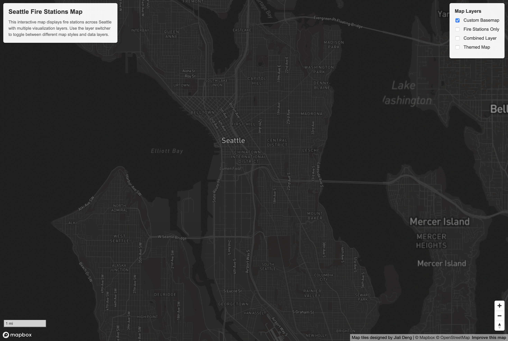
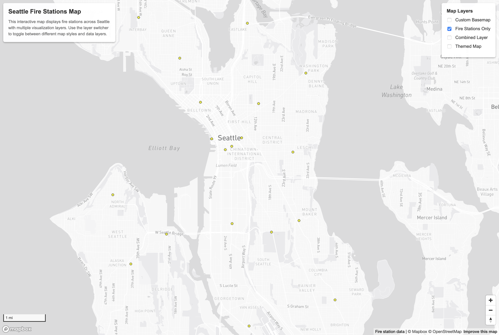
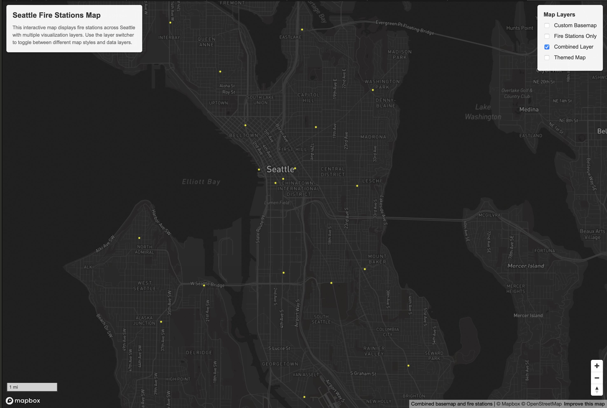
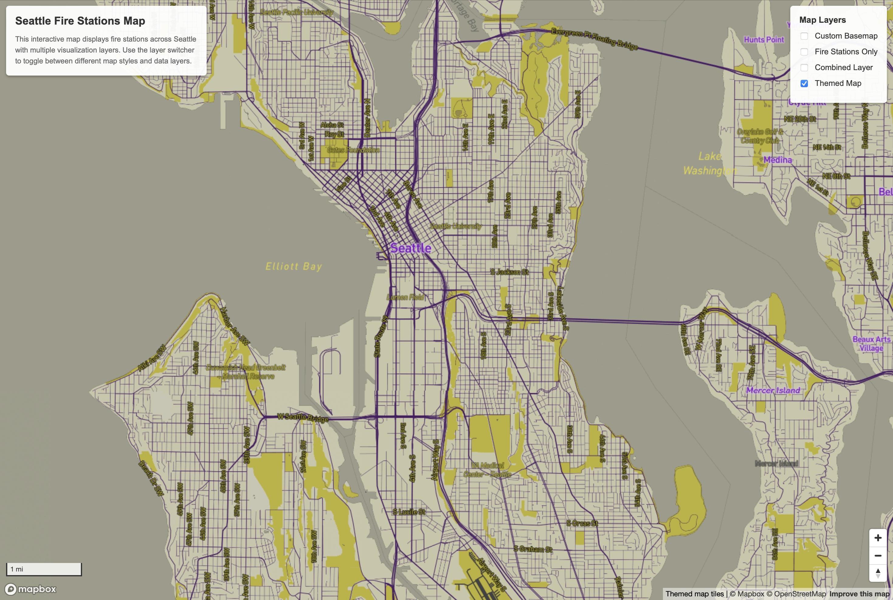

# Seattle Fire Stations Tile Generation Map

## Introduction
This project creates an interactive web map that visualizes fire stations across Seattle using multiple custom tile layers. The map demonstrates the process of tile generation and layer management through four distinct tilesets, each serving a different cartographic purpose. Users can toggle between different map styles and data layers to explore various visualization approaches for geographic data.

## Map Access
**Web Map URL:** [https://jdeng137.github.io/tilegenerationmap/](https://jdeng137.github.io/tilegenerationmap/)

## Screenshots

### Tileset 1: Custom Basemap

### Tileset 2: Thematic Layer (Fire Stations Only)

### Tileset 3: Combined Layer (Basemap + Fire Stations)

### Tileset 4: Themed Mapbox Layer

## Geographic Area
**Examined Region:** Greater Seattle Area, Washington, United States

**Center Coordinates:** -122.31987°W, 47.59379°N

**Initial Zoom Level:** 12

## Available Zoom Levels

All four tilesets follow the standard XYZ tile structure (`{z}/{x}/{y}.png`) and are stored as 256x256 pixel PNG tiles with the zoom levels 11-15.

## Tile Set Descriptions

### Tileset 1: Custom Basemap
This custom-designed Mapbox basemap layer shows streets, water bodies, and geographic features of the Greater Seattle area. This basemap serves as the foundation layer with neutral styling designed by me (Jiali Deng). It can be toggled on/off independently to compare with the default Mapbox light basemap.

### Tileset 2: Thematic Layer (Fire Stations Only)
This thematic overlay layer displays only fire station locations without any basemap context. This layer isolates the fire station data and can be combined with any basemap for flexible visualization overall showing fire station point data across the Greater Seattle area.

### Tileset 3: Combined Layer
This combined map layer combines the custom basemap (Tileset 1) with fire station data (Tileset 2) into a single pre-rendered tileset. This approach improves rendering performance by serving both the basemap and data layer together rather than loading them separately.

### Tileset 4: Themed Mapbox Layer
This tile set is a Mapbox-designed theme layer based on University of Washington colors. The styling uses coordinated color choices, labels, and visual design elements to reflect the UW theme. This layer loads as the default map view when the application opens.

## Primary Functions

- **Layer Switching:** Toggle visibility of four different tile layers using checkboxes in the layer switcher
- **Navigation Controls:** Zoom and pan controls located in the bottom-right corner
- **Scale Bar:** Distance scale in imperial units (bottom-left)
- **Default View:** Map centers on Greater Seattle at zoom level 12 with Themed Map layer visible by default

## Libraries and Technologies

- **Mapbox GL JS (v3.18.1)** - Core mapping library for interactive web map rendering
- **HTML/CSS** - Web interface structure and styling
- **JavaScript** - Map functionality and layer switching interactivity

## Data Sources

- **Fire Station Data:** [https://data-seattlecitygis.opendata.arcgis.com/datasets/811aa344a72d44e88383ee0c4f3d25d9_0/explore?location=47.619160%2C-122.335881%2C12](https://data-seattlecitygis.opendata.arcgis.com/datasets/811aa344a72d44e88383ee0c4f3d25d9_0/explore?location=47.619160%2C-122.335881%2C12)
- **Basemap Data:** Custom designed by Jiali Deng

## Acknowledgments

- Geography 458 w/ Professor Bo Zhao
- University of Washington

## AI Disclosure

Utilized AI to help debug and to help me integrate upper level Javascript and CSS features mentioned in the primary functions portion of this readme file.